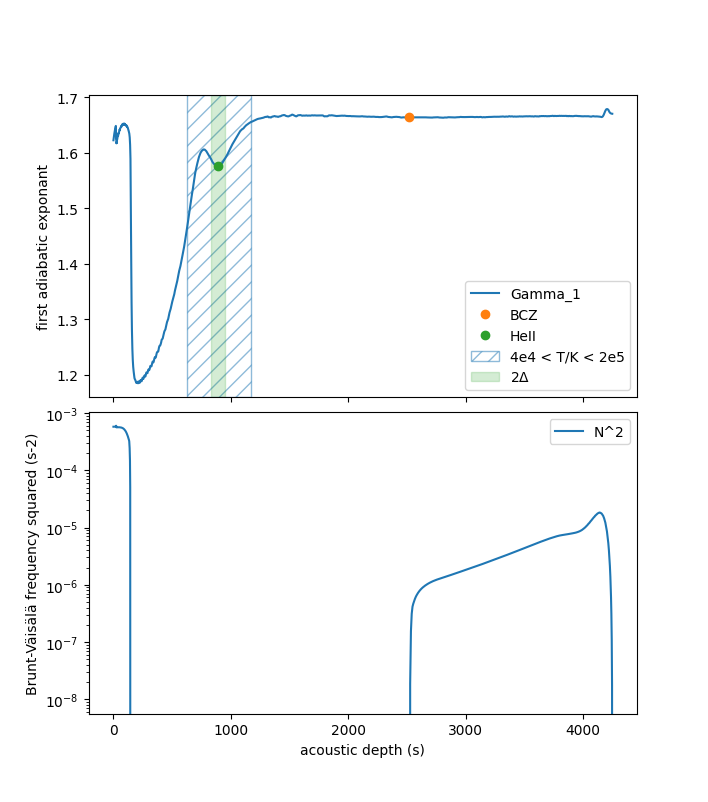

# gyraffe

The (GYRE) acoustic-glitch finder estimates parameters associated with models of acoustic glitches inside stars from model stellar profile data.

This package is not affiliated with the [GYRE](https://github.com/rhdtownsend/gyre) project but makes use of [PyGYRE](https://github.com/rhdtownsend/pygyre) to read GYRE files. This is intended to be used by someone who works with GYRE and has these files lying around, but in theory there is no reason why you couldn't give `gyraffe` any text file formatted the same way.

## Installation

Either clone/fork this repository and install using `pip install -e .` or,

```shell
pip install git+git://github.com/alexlyttle/gyraffe@main
```

and to upgrade,

```shell
pip install --upgrade git+git://github.com/alexlyttle/gyraffe@main
```

## Usage

To extract estimates for acoustic glitch parameters tau_he, delta_he, amp_he and tau_cz (descriptions and references for these coming soon) run the following command in your terminal application of choice,

```shell
gyraffe <filename(s)>
```

where `<filename(s)>` is the path(s) the profile input file(s).

You can use the `-p` flag to produce plots showing the approximate location of each acoustic glitch in the star as a function of estimated acoustic depth.

For example,



## About

### Acoustic depth

The acoustic depth at each point of the stellar profile is found by numerically integrating the inverse of the sound-speed profile with respect to radial coordinate.

### Base of the convective zone

The acoustic depth of the base of the convective zone is found by taking the first coordinate where the Brunt-Vaisala frequency squared goes from positive to negative. This needs more testing, so use the diagnostic plots to double-check.

### Second ionisation of helium

The second ionisation of helium occurs in a region of the star, so we define its acoustic depth as the coordinate at the trough of the induced dip in the first adiabatic exponent (Gamma1). This is found by taking the minimum stationary point of Gamma1 the region of temperature from 40,000 K to 200,000 K where helium is expected to ionise for solar-like stars. This also needs more testing so use the plots to double-check.
